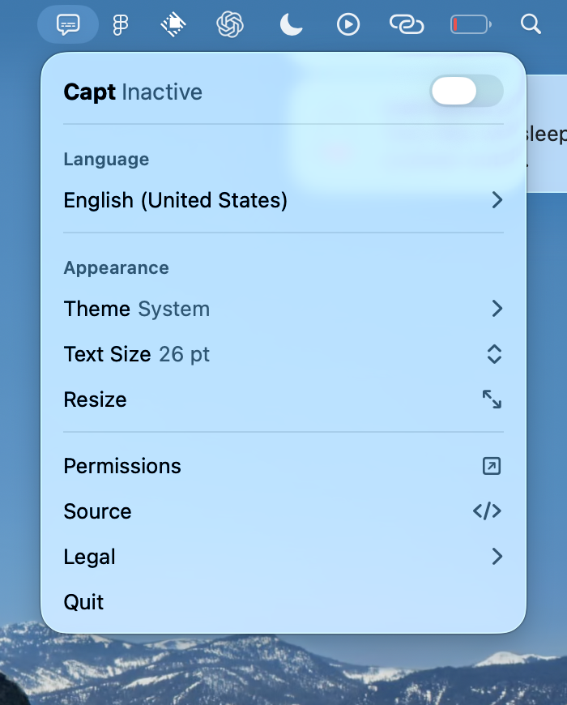

# Capt

Live, on-device captions for anything your Mac is playing.

Capt taps system audio, transcribes it with Apple's on-device SpeechAnalyzer,
and draws captions in a click-through overlay above every window, including fullscreen
video. Capt has no servers, accounts, advertising, analytics, telemetry, crash reporting, or other
tracking. Audio and caption text stay in memory and are never saved or sent anywhere.

Born from watching videos on sites that don't ship captions. Accessibility first.

## Download and install

[Download the latest release](https://github.com/vznh/capt/releases/latest).
The current downloads require an **Apple Silicon Mac (M1 or newer) and macOS 26+**.

For newer changes, [PR and master preview builds](https://github.com/vznh/capt/actions/workflows/build.yml)
are available as Actions artifacts. Only version tags publish releases; see [RELEASE.md](RELEASE.md).

1. Download the DMG from the release page.
2. Open it and drag Capt into Applications.
3. Open Capt, click its menu bar icon, select the spoken language, and enable Capt.
4. Grant System Audio Recording permission when prompted. The first use of a language
   may download Apple's on-device speech model.

Current alpha downloads are ad-hoc signed and **not notarized by Apple**. If macOS blocks
opening Capt and you trust this release, follow the release page's first-launch instructions
or [Apple's guidance](https://support.apple.com/en-us/102445).

The released app reflects its tagged source; the features documented below may include newer
changes on the default branch.

## Known limitations

- **Language is chosen, not detected.** SpeechAnalyzer needs a locale up front. Auto-detection needs a
  cloud engine behind the same protocol.
- **The overlay uses the primary display.** Layouts are stored per display, but Capt currently shows
  its caption panel only on the display macOS treats as primary.
- **Signing identity is chosen automatically.** `build.sh` prefers a Developer ID Application or
  Apple Development certificate from the keychain, so the code signature (and the System Audio
  Recording grant keyed to it) survives rebuilds. `CAPT_SIGN_IDENTITY` overrides the choice;
  `-` forces ad-hoc, and the script warns that permissions may be re-requested after each rebuild.
- **Local builds are not notarized.** The build script produces a hardened, signed app for local use;
  use `Scripts/package.sh release` for notarized downloads (see [RELEASE.md](RELEASE.md)).
- If captions never appear and the panel says no audio is being detected, grant System Audio Recording
  in System Settings › Privacy & Security.

## Contributing

See [CONTRIBUTING.md](CONTRIBUTING.md). Security and privacy reports go to [SECURITY.md](SECURITY.md).

## License and legal

Capt is source-available under the [Functional Source License 1.1, MIT Future License](LICENSE):
use, modify, and redistribute it for any purpose except building a competing commercial product,
and each version becomes MIT-licensed two years after release. Third-party notices are in
[NOTICE](NOTICE); Core Audio helpers are adapted from
[insidegui/AudioCap](https://github.com/insidegui/AudioCap), BSD 2-Clause. End-user terms are in
[TERMS.md](TERMS.md) and the privacy policy in [PRIVACY.md](PRIVACY.md).
